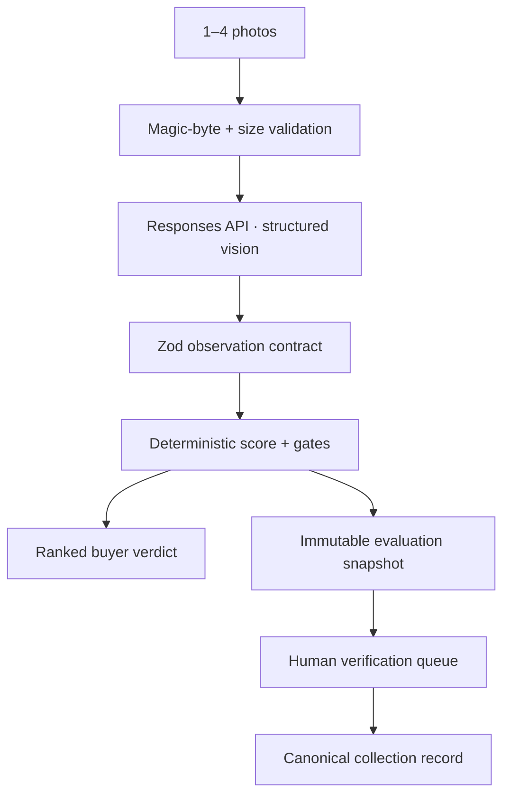

# Hot Wheels Frontier Analyst

An evidence-first, multimodal buyer’s agent for exact-release identification, transparent ranking, regional price discipline, proactive case hunting, and longitudinal collection intelligence.

> **Status:** production-oriented foundation. The deterministic core, multimodal contract, US retail dataset, APIs, persistence model, security boundary, tests, eval fixtures and responsive interface are implemented. External release retrieval and sold-transaction providers remain explicit integrations—not fabricated capabilities.

## Why this architecture is different

Most collectible assistants collapse taste, scarcity, condition and price into one suspiciously precise number. This system produces four independent signals:

| Signal | Owner | Meaning |
|---|---|---|
| Collection Priority Score | Deterministic TypeScript | How strongly the exact release fits the collection thesis |
| Market Evidence Grade | Evidence rules | Strength of identity/liquidity support, not asking-price hype |
| Condition Gate | Visual observation + rules | Whether this copy supports a sealed/carded hold |
| Price Gate | Timestamped regional data | Whether the shelf price is strong, fair or inflated |

The model extracts bounded observations. It never owns arithmetic, ownership state, or database promotion.



## Implemented product surface

- Camera capture, gallery upload, drag/drop and autocomplete-assisted name search.
- Multi-photo, multi-car analysis with up to 20 ranked observations; text-only analysis keeps visual claims gated.
- Exact-release fields, chase-marker restraint, confidence and verification queue.
- Conservative, product-line-specific case/mix inference and proactive targets.
- Collection Priority Score v2.0 with seven bounded components.
- Independent market, condition and regional price gates.
- US/USD retail benchmark snapshot dated 2026-08-27.
- Complete 2026 TH/STH visual case grid with 30 exact-release references and source attribution.
- Supabase model for releases, evidence, collection, insights, prices, targets and audits.
- Protected collection API, rate limiting, file-signature validation, security headers, traces and `store: false` calls.
- Golden eval contract, regression tests and responsive Daly Ventures UI.

## API

| Route | Method | Purpose |
|---|---|---|
| `/api/analyze` | POST multipart | Analyze 0–4 images and/or a typed car query; rank supported releases |
| `/api/score` | POST JSON | Run deterministic score and gate policy |
| `/api/targets` | GET | Current target board and 2026 hunt map |
| `/api/prices` | GET | US/USD retail benchmark snapshot |
| `/api/reference-image` | GET | Allowlisted, cached relay for attributed hunt-map references |
| `/api/collection` | GET/POST | Protected collection persistence |
| `/api/health` | GET | Deployment health |

## Local development

```bash
cp .env.example .env.local
npm ci
npm run dev
```

Required for analysis: `OPENAI_API_KEY`. Optional persistence: run both SQL migrations in Supabase and configure its URL/service role. Set a high-entropy `HOTWHEELS_ADMIN_TOKEN` for collection endpoints.

```bash
npm run check
```

## Deployment

Deploy on Vercel, connect Supabase, and map `hotwheels.dalyventures.com`. Link from `dalyventures.com/fund`; keep all privileged keys server-side. Use separate staging/production projects and spend limits before public traffic.

## Repository map

- `app/` — product UI and route handlers
- `lib/` — schemas, model adapter, scoring, price policy, security and persistence
- `data/` — versioned regional/target snapshots
- `supabase/migrations/` — append-only schema and RLS boundary
- `evals/` — golden agent-behavior contract
- `tests/` — deterministic regression suite
- `agent/` — canonical analyst doctrine
- `docs/` — architecture, deployment, data and roadmap

## Data and IP posture

No original user workbook, raw collection photo, marketplace scrape, Mattel artwork or third-party database dump is committed. The chase grid hotlinks third-party release references with direct source attribution and a local unavailable-image fallback; it does not redistribute those image files. Seed JSON contains derived research with dates and provenance. Sold transactions—not active listings—must support value claims.

Collection priority is not a return forecast. This independent project is not affiliated with or endorsed by Mattel.
