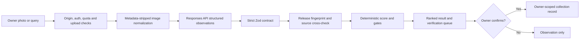

# Hot Wheels Collector Intelligence

A public, precomputed rules demo paired with an owner-only, evidence-governed collector workspace for identifying exact Hot Wheels releases, recognizing chase candidates, ranking collection fit, applying price discipline, and keeping observations separate from confirmed ownership.

> **Release status:** the application, security boundary, database migrations, tests, source register, and deployment runbook are implemented. A production instance still requires the operator to apply the Supabase migrations and configure the documented environment variables. Market values remain unknown until an authorized completed-sales source supplies exact, recent sold comparables.

## What it does

- Lets any visitor explore three clearly fictional, precomputed decision scenarios without an account, upload, model call, or collection access.
- Accepts one to four JPEG, PNG, or WebP collector photos, or a typed car query.
- Normalizes images, removes metadata, bounds resolution and bytes, and sends them through the OpenAI Responses API with structured output and `store: false`.
- Uses the model for observations—not arithmetic, database ownership, or unverified market claims.
- Builds a release fingerprint from year, casting/tooling, line, mix, collector number, product code, color, chase state, wheels, card, and region.
- Fails closed when the exact release is unresolved: the result becomes **Verify first**, not a confident buy or valuation call.
- Calculates Collection Priority Score v3.1 deterministically from named, bounded features.
- Separates visual evidence, market evidence, condition, price, collection fit, and duplicate intent.
- Provides an attributed 2026 TH/STH grid, with exact HWtreasure item links and Orange Track cross-checks. External images remain on the publisher’s page.
- Defines a rights-governed media registry, private evidence store, request queue, audit trail, and fail-closed public manifest. No third-party car or package photo ships without exact-release and rights approval.
- Uses owner-only Supabase Auth, row-level security, distributed quotas/concurrency, audit records, retention controls, and detail-free health endpoints.

## Decision model

| Signal | Meaning | Owner |
|---|---|---|
| Collection Priority Score | How strongly this exact release fits the collection thesis | Deterministic TypeScript |
| Visual Evidence Grade | How well the photos support the observed identity and condition | Evidence rules |
| Market Evidence Grade | Number and quality of recent exact completed sales | Evidence rules; never asking prices |
| Exact-release gate | Whether the release is specific enough for a decision | Release fingerprint policy |
| Price gate | Whether a fresh regional shelf-price snapshot supports the price | Dated local snapshot |
| Recommendation | Buy, wait, skip, or verify first, adjusted for owned quantity and copy intent | Deterministic policy |



## Source governance

The eight supplied specialist references were reviewed and distilled into a governed [source register](docs/SOURCE_REGISTER.md) and machine-readable [source catalog](data/source-catalog.json). They support discovery, casting/tooling, release-line, TH/STH, premium-chase, vocabulary, and watchlist claims within explicit freshness limits.

They do **not** establish fair value, production quantity, live availability, or verified exact identity on their own. Future-year and incomplete entries remain provisional. Derived facts are attributed; tables, prose, affiliate prices, and images are not copied wholesale.

No eBay sold feed is present. Finding/Shopping were decommissioned, Browse represents purchasable listings rather than sold evidence, and Marketplace Insights is currently restricted to existing approved users. Asking prices and guessed fees never substitute for exact completed sales; see the [market-data boundary](docs/DATA_POLICY.md#current-ebay-boundary).

## Governed media

`data/media-manifest.json` intentionally starts empty. Missing media uses the local silhouette; it never triggers runtime scraping, hotlinking, copying, background removal, or image generation. A car cutout, package view, detail photograph, render, or illustration may enter the public manifest only after:

1. the asset is tied to a human-verified exact `releases` row and pins the release fingerprint that was actually reviewed;
2. private permission evidence identifies the rights holder and allowed channels/transformations;
3. a human approves identity, attribution, term, territory, and takedown details; v1 publishes only a canonical `worldwide` grant, while regional grants remain review-only; and
4. the public-delivery derivative has verified dimensions, content hash, transformation version, an applied-transformation list permitted by the license, and explicit metadata stripping. After verification, its content fields are immutable; replacement requires a new rendition version linked as a supersession.

Migration `006_governed_media_rights.sql` enforces the database side. Assets cannot be inserted already approved. The system preserves the last approval time and evidence reference. Any later publication-permission change—directly or after an unchanged move to `review_pending`—requires cleared review fields, a different immutable evidence reference verified after that last approval, and a new human review. Existing evidence can only be withdrawn, never rewritten or restored. Emergency revoked/takedown transitions remain immediate but may change only the revocation timestamp/reason. Identity, rights, lifecycle, rendition integrity, and current/supersession changes emit independent audit events. [`lib/media-schema.ts`](lib/media-schema.ts) validates sanitized public manifests, and [`lib/media-manifest.ts`](lib/media-manifest.ts) returns a display-safe projection only when approval, reviewed-fingerprint equality, worldwide publication eligibility, channel, manifest/evidence time, withdrawal, revocation, attribution, metadata stripping, transformation authorization, and integrity checks all pass. The worldwide rule is fail-closed policy, not geolocation enforcement. Permission references, takedown contacts, contracts, regional terms, and private operational fields never enter that public result. See [ADR-0002](docs/adr/0002-governed-release-media.md) and the [data policy](docs/DATA_POLICY.md).

## Local development

Requirements: Node.js 22 or newer and npm.

```bash
cp .env.example .env.local
npm ci
npm run dev
```

For a local UI-only session, `HOTWHEELS_DEV_AUTH_BYPASS=true` is permitted outside production. Never enable it in a shared environment. Real analysis needs `OPENAI_API_KEY`; authenticated collection use needs Supabase and the owner bootstrap described in [SECURITY.md](SECURITY.md).

Apply all migrations in order:

1. `001_initial.sql`
2. `002_production_model.sql`
3. `003_trust_safety_upgrade.sql`
4. `004_release_evidence_model.sql`
5. `005_analysis_concurrency.sql`
6. `006_governed_media_rights.sql`

## Verification

```bash
npm run check
npm run test:coverage
npm audit --audit-level=high
```

`npm run check` runs lint, type checking, unit/contract tests, and a production build. See [CONTRIBUTING.md](CONTRIBUTING.md) for change rules and [docs/DEPLOYMENT.md](docs/DEPLOYMENT.md) for promotion and rollback.

## API surface

| Route | Method | Purpose |
|---|---|---|
| `/api/session` | GET/POST/DELETE | Check, create, or clear the owner session |
| `/api/analyze` | POST multipart | Analyze up to four images and/or a typed query |
| `/api/score` | POST JSON | Apply owner-authenticated deterministic score and decision gates |
| `/api/collection` | GET/POST | Owner-scoped collection access |
| `/api/targets` | GET | Versioned target and chase reference data |
| `/api/prices` | GET | Dated regional retail snapshot |
| `/api/health` | GET | Detail-free liveness |
| `/api/ready` | GET | Token-protected configuration/database readiness |

## Important boundaries

- A photo is an observation, not proof of ownership.
- A casting name is not an exact release. Incomplete fingerprints never merge automatically.
- A duplicate is evaluated by its marginal role: sealed upgrade, open copy, trade copy, or unnecessary duplicate.
- Active listings are seller expectations, not sold comparables.
- Chase paint, wheel style, or a model suggestion alone cannot verify TH/STH/0-of-5 status.
- A source-page image, shop image, official-looking asset, disclosure, background removal, crop, or generated imitation does not establish reuse permission. Runtime media discovery never publishes automatically.
- The application is independent and is not affiliated with or endorsed by Mattel.
